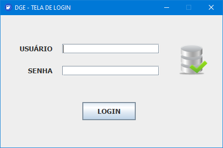
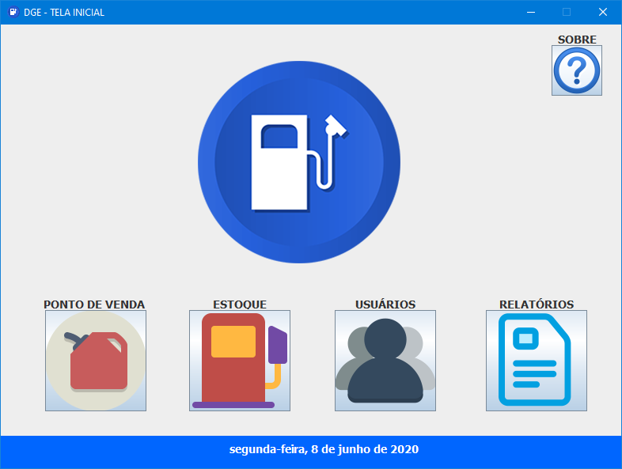
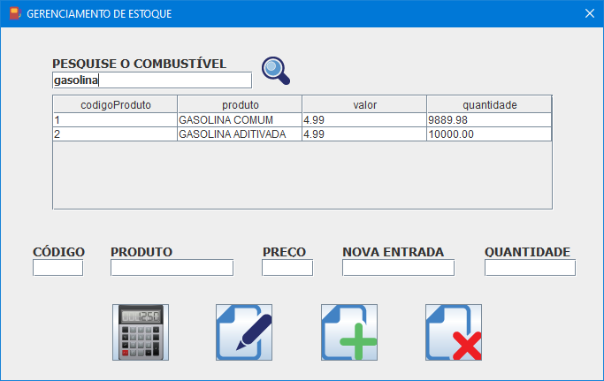
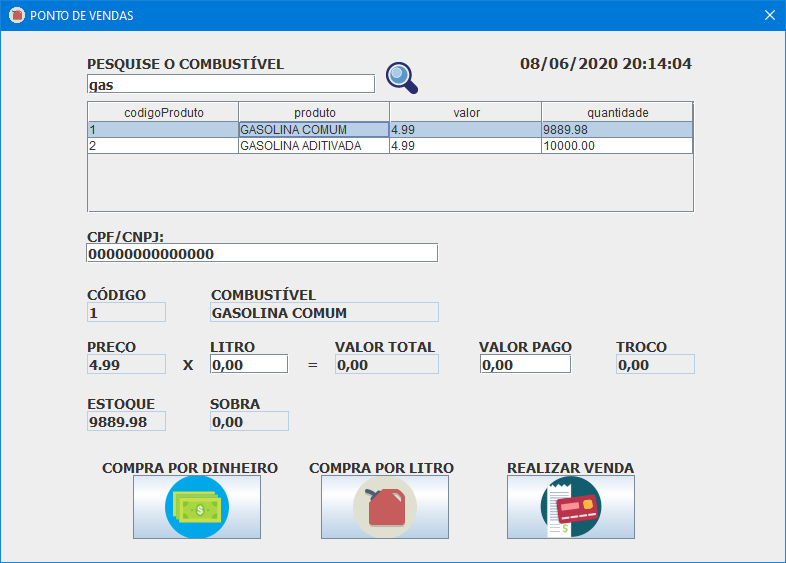
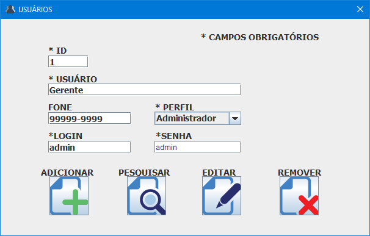
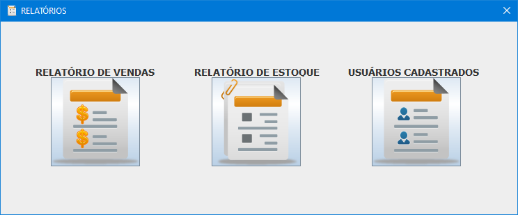
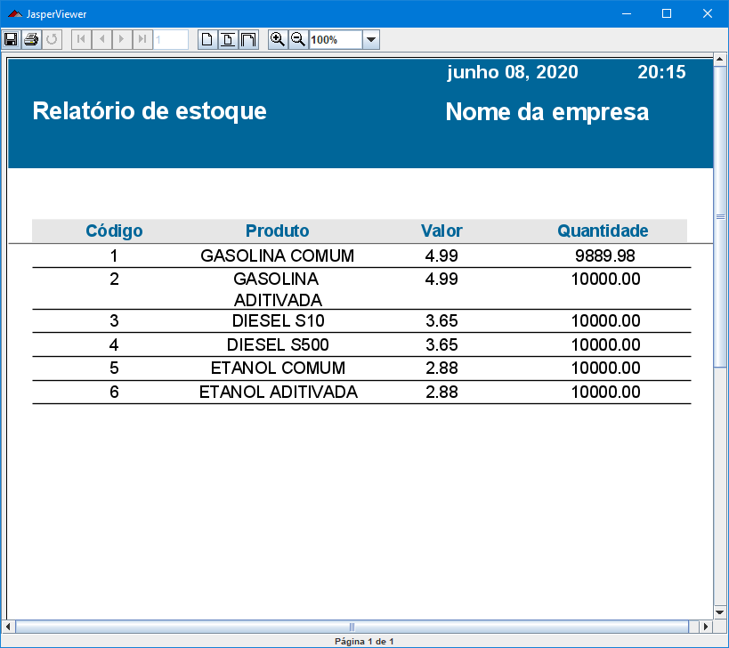

# GDE - Gerenciador de postos de combustíveis 
<h2>Sistema de Vendas para Postos de Combustível em java com interface gráfica</h2>
<h3>PDV - Ponto de vendas</h3>
<h3>Gerenciamneto de estoque</h3>
<h3>Cadastro de usuários</h3>
<h3>Impressão de relatórios</h3>
 

Projeto realizado em sala, na instituição Senac Tatuapé no ano de 2019

<h4>Ferrementas utilizadas</h4>

Eclipse IDE

java JDK 11.0.3

MySQL Workbench 8.0 CE

TIBCO Jaspersoft Studio-6.10.0

 
<h2>Imagens do Programa</h2>
 
<h4>Tela de Login</h4>

 
<h4>Tela Principal</h4>

 
<h4>Tela de estoque</h4>

 
<h4>Tela do PDV (Ponto de Vendas)</h4>

 
<h4>Tela de cadastro, exclusão, e atualização de usuarios</h4>

 
<h4>Tela de relatórios</h4>

 
<h4>Relatório impresso</h4>

 
